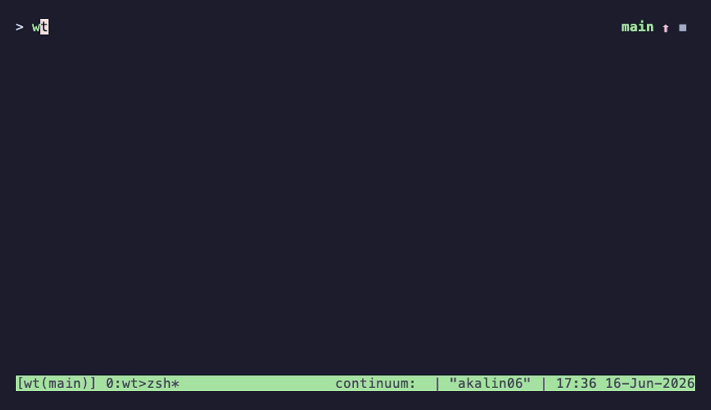

# wt — git worktree helper

A lightweight bash/zsh shell function for managing [git worktrees](https://git-scm.com/docs/git-worktree) with fuzzy-finding and optional tmux, GitHub, and direnv integration.

## Features

- Fuzzy-navigate to any existing worktree
- Create worktrees for local branches, remote branches, or new branches
- Check out GitHub issues and PRs directly into worktrees
- Open each worktree in a dedicated, named tmux session
- Copy `.envrc` and run `direnv allow` automatically
- Delete worktrees and their tmux sessions in one step
- Works whether sourced as a shell function or run as a script

## Dependencies

| Tool | Required | Used for |
|------|----------|----------|
| `git` | Yes | Everything |
| [`fzf`](https://github.com/junegunn/fzf) | Yes | Fuzzy selection menus |
| [`gh`](https://cli.github.com/) | For `-i` / `-p` | GitHub issue and PR listing |
| [`tmux`](https://github.com/tmux/tmux) | For `-t` | Worktree sessions |
| [`direnv`](https://direnv.net/) | For `-e` | Per-worktree environment |

## Installation

1. Copy `wt` to `~/bin/` (or anywhere on your `PATH`):

   ```sh
   curl -fsSL https://raw.githubusercontent.com/alexg9010/wt/main/wt -o ~/bin/wt
   chmod +x ~/bin/wt
   ```

2. Add the following to your `~/.profile`, `~/.bashrc`, or `~/.zshrc`:

   ```sh
   # git worktree helper
   if [ -f ~/bin/wt ]; then
     source ~/bin/wt
     alias wtt="wt -t"   # shorthand: create worktree + open tmux session
   fi
   ```

3. Reload your shell:

   ```sh
   source ~/.profile   # or ~/.bashrc / ~/.zshrc
   ```

## Demo


*Create a worktree, fuzzy-navigate between worktrees, and delete one.*



*Create a worktree with a dedicated tmux session and switch between sessions.*

## Usage

```
wt [-i] [-p] [-c [name]] [-e] [-t] [-d [path]] [-h]
```

| Flag | Description |
|------|-------------|
| *(none)* | Fuzzy-select an existing worktree and `cd` into it |
| `-c [name]` | Create a worktree for `name`; fuzzy-selects a branch if omitted |
| `-i` | Fuzzy-select a GitHub issue → create `issue/<number>` worktree |
| `-p` | Fuzzy-select a GitHub PR → check out its branch in a worktree |
| `-e` | Copy `.envrc` from the repo root and run `direnv allow` (use with `-c`) |
| `-t` | Open or attach a tmux session for the worktree (use with `-c`, or alone to select) |
| `-d [path]` | Delete a worktree; fuzzy-selects if no path given, `'.'` for current |
| `-h` | Show help |

### Examples

```sh
# Navigate to an existing worktree
wt

# Create a worktree for an existing branch
wt -c my-feature

# Create a worktree and open it in a tmux session
wt -c my-feature -t
# or with the alias:
wtt -c my-feature

# Pick a GitHub issue and create a worktree for it
wt -i

# Review a pull request in its own worktree
wt -p

# Create a worktree, copy .envrc, and start a tmux session
wt -c my-feature -e -t

# Delete a worktree (fuzzy-select)
wt -d

# Delete the current worktree
wt -d .
```

## Configuration

| Variable | Default | Description |
|----------|---------|-------------|
| `WORKTREE_ROOT` | `<repo>/.worktrees` | Directory where worktrees are created |
| `WT_TMUX_AUTOCD` | *(unset)* | Set to any value to auto-switch tmux sessions when navigating inside tmux (implies `-t`) |

The worktree directory is automatically added to `.gitignore` if it lives inside the repo.

### tmux session naming

Sessions are named `<repo>(<branch>)`, e.g. `myproject(feature-login)`. Deleting a worktree also kills its tmux session.

## License

MIT
